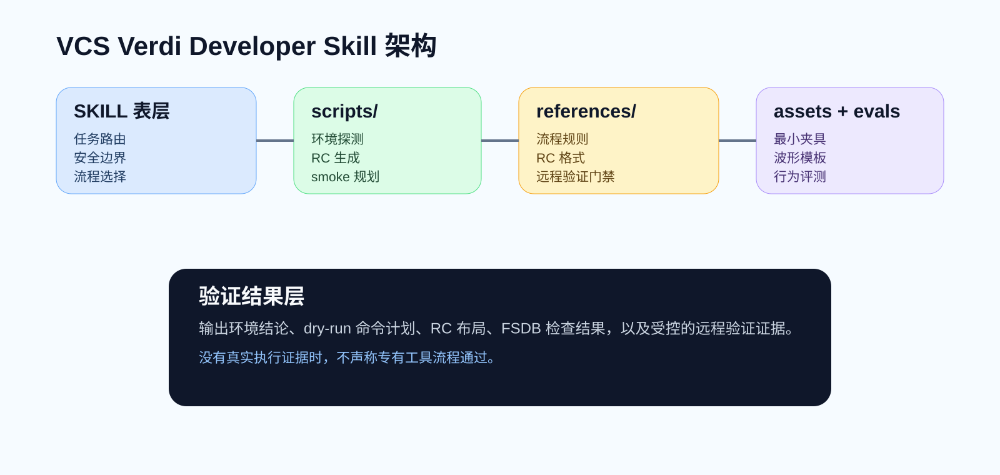
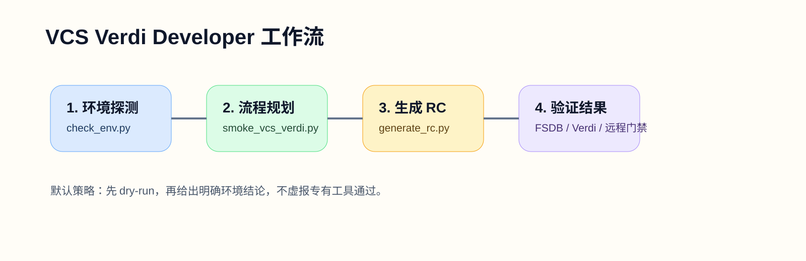

<p align="center">
  <a href="README.md">English</a>
  <span>&nbsp;|&nbsp;</span>
  <a href="README-CN.md"><strong>中文</strong></a>
</p>

<p align="center">
  
</p>

<p align="center">
  <a href="LICENSE"></a>
  <a href="pyproject.toml"></a>
  
  <a href="SKILL.md"></a>
  <a href="references/vcs-verdi-flow.md"></a>
</p>

<h1 align="center">VCS Verdi Developer</h1>

<p align="center">
  面向 Synopsys VCS 仿真与 Verdi 波形调试流程的 Codex agent skill。
</p>

VCS Verdi Developer 用来帮助 AI 编程代理更可靠地处理 Synopsys VCS 与 Verdi 工作流。仓库中包含工作流说明、可复用夹具、参考文档、评测样例，以及面向非 GUI 编译/仿真规划、FSDB 生成与读回、RC 布局、项目导入、coverage 诊断、回归执行、Verdi 交互和远程验证的确定性辅助脚本。

这个仓库首先是一个 **agent skill package**。主要入口是代理可加载、可遵循的 skill 结构，而脚本部分负责围绕专有 EDA 工具流程提供可重复的检查与辅助能力。

## 为什么需要它

EDA 工作流很容易因为环境判断、GUI 假设或 dump/debug 步骤处理不当而出错。VCS Verdi Developer 主要补上这些工程化环节：

- 在调用专有工具前先做环境就绪检查；
- 用可重复的方式规划 VCS compile / elaborate / simulate；
- 支持 manifest 驱动的项目导入与 non-GUI 流程归一化；
- 支持 FSDB 生成、读回与转换规划；
- 支持 coverage 与 URG 诊断规划；
- 支持回归批量执行与证据收集；
- 校验 Verdi 加载；
- 生成可复用的 signal-restore RC 布局；
- 提供面向默认远程 EDA 服务器的验证门禁。

## Skill 架构

<p align="center">
  
</p>

## 工作流

<p align="center">
  
</p>

## 仓库结构

| 路径 | 作用 |
| --- | --- |
| `SKILL.md` | 面向 agent 的路由、流程、约束和安全边界。 |
| `agents/openai.yaml` | skill 调用入口的 UI 元数据。 |
| `scripts/` | 环境检查、RC 生成、smoke 规划、项目导入、FSDB 工具、coverage 诊断、回归与远程 wrapper 的确定性脚本。 |
| `references/` | VCS/Verdi 流程规则、能力边界、non-GUI 指南、RC 格式说明和验证门禁。 |
| `assets/` | 最小夹具、manifest 示例、include 文件和波形布局模板。 |
| `evals/` | 定义 with-skill 预期行为的评测样例。 |
| `docs/assets/` | 仓库 README 页面使用的展示图。 |
| `RELEASE_RECEIPT.json` | 导入的 `v0.4.8` 发布包来源记录。 |

## 快速开始

把本仓库放入 Codex skill 搜索路径即可作为 agent skill 使用。做本地检查或调用辅助脚本时：

```powershell
python .\scripts\check_env.py --json
python .\scripts\generate_rc.py --help
python .\scripts\smoke_vcs_verdi.py --help
python .\scripts\import_vcs_project.py --help
python .\scripts\coverage_flow.py --help
python .\scripts\run_regression.py --help
```

推荐顺序：

1. 先用 `scripts/check_env.py --json` 探测环境。
2. 如果输入来自 Makefile、filelist 或 Edalize/CAPI2 元数据，先用 `scripts/import_vcs_project.py` 做项目导入或归一化。
3. 用 `scripts/generate_rc.py` 生成或复核波形布局 RC。
4. 用 `scripts/smoke_vcs_verdi.py --dry-run` 规划最小或 manifest 驱动的 VCS/Verdi smoke 流程。
5. 当任务扩展到 coverage、波形读回、批量执行或证据收集时，使用 `scripts/coverage_flow.py`、`scripts/fsdb_tools.py`、`scripts/run_regression.py` 和 `scripts/collect_evidence.py`。
6. 只有在命令计划和环境结论都被确认后，才执行真实流程。

## 适用边界

VCS Verdi Developer 的边界是刻意收窄的：

- 它聚焦于 Synopsys VCS 和 Verdi 工作流，不覆盖通用 RTL 开发或综合流程。
- 只有在真实 VCS/Verdi 流程确实运行后，才可以声称验证通过。
- 优先支持脚本化 non-GUI 验证，Verdi GUI 使用是可选能力，且取决于远程显示环境。
- 不应暴露真实 license 值、内部服务器细节、私有路径或私有基础设施信息。
- 它支持受控子集的 import、coverage、URG、FSDB 和远程验证流程，而不是全部 Synopsys 特性。

## 机构说明

Jiyuan Liu 和 He Li 隶属于东南大学电子科学与工程学院。
两位作者所在团队为东南大学电子科学与工程学院异构智能与量子计算实验室（HIQC课题组），相关工作面向异构智能、量子计算及相关计算系统研究。

## 联系方式

问题、合作或学术使用，请联系：[erie@seu.edu.cn](mailto:erie@seu.edu.cn)。

## 安全与敏感信息

- 不要提交真实 license 文件、secret token、私钥或内部主机信息。
- 像 `SNPSLMD_LICENSE_FILE` 这样的环境变量如果包含真实值，也应视为敏感信息。
- 在发布或 push 前，应对导入工件做敏感信息复核。

## 引用

本 skill 由东南大学电子科学与工程学院异构智能与量子计算实验室（HIQC课题组）相关作者维护。

如果本 skill 对你的研究、教学或工程流程有帮助，请引用。规范引用元数据以 [CITATION.cff](CITATION.cff) 为准。

```bibtex
@software{liu_2026_vcs_verdi_developer,
  author       = {Jiyuan Liu and He Li},
  title        = {{VCS Verdi Developer}: An Agent Skill for Synopsys VCS and Verdi Workflows},
  year         = {2026},
  version      = {0.4.8},
  date         = {2026-05-15},
  url          = {https://github.com/Eriemon/vcs-verdi-developer},
  license      = {Apache-2.0},
  note         = {Agent skill package for Synopsys VCS simulation, project import, FSDB tooling, coverage diagnostics, and Verdi waveform-debug workflows}
}
```

## 许可证

Apache License 2.0，详见 [LICENSE](LICENSE)。
