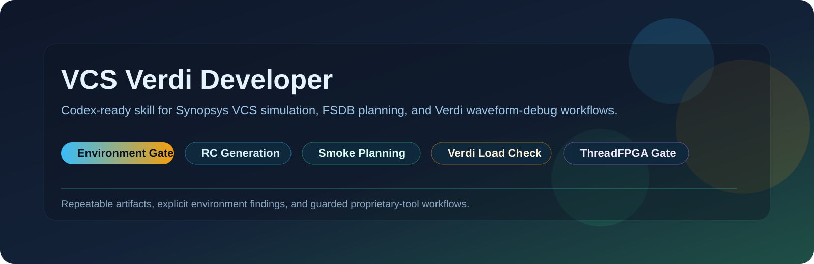
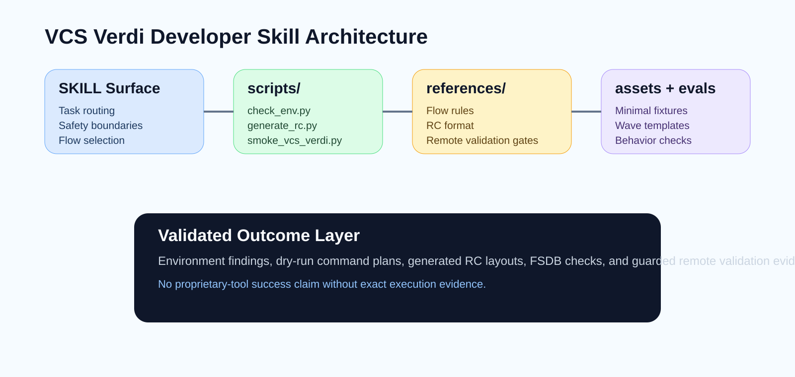
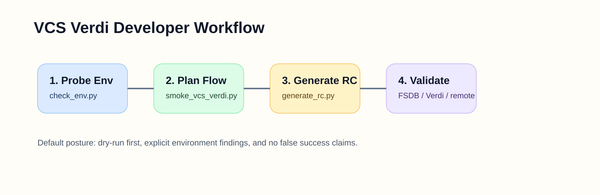

<p align="center">
  <a href="README.md"><strong>English</strong></a>
  <span>&nbsp;|&nbsp;</span>
  <a href="README-CN.md">中文</a>
</p>

<p align="center">
  
</p>

<p align="center">
  <a href="LICENSE"></a>
  <a href="pyproject.toml"></a>
  
  <a href="SKILL.md"></a>
  <a href="references/vcs-verdi-flow.md"></a>
</p>

<h1 align="center">VCS Verdi Developer</h1>

<p align="center">
  A Codex-ready agent skill for Synopsys VCS simulation and Verdi waveform-debug workflows.
</p>

VCS Verdi Developer helps an AI coding agent work more reliably with Synopsys VCS and Verdi. It packages workflow instructions, reusable fixtures, reference material, evaluation cases, and deterministic helper scripts for non-GUI compile/simulate planning, FSDB generation and readback, RC layout generation, project import, cocotb VCS/VPI planning, coverage planning, regression orchestration, claim/evidence gating, Verdi interaction, and remote validation flows.

This repository is primarily an **agent skill package**. The main interface is the skill surface an agent can load and follow, while the scripts provide deterministic checks and helper behavior around the proprietary tool flow.

## Why It Exists

EDA workflows are easy to mis-handle when an agent guesses environment readiness, GUI assumptions, or dump/debug steps. VCS Verdi Developer adds a disciplined layer for:

- environment readiness checks before proprietary tools run,
- repeatable VCS compile/elaborate/simulate command planning,
- manifest-driven project import and non-GUI flow normalization,
- cocotb VCS/VPI planning with explicit guarded boundaries,
- FSDB generation, readback, and conversion planning,
- coverage and URG diagnostic planning,
- regression batching and evidence collection,
- factual-claim and evidence gating before readiness statements,
- guarded Verdi load verification,
- generated signal-restore RC layouts,
- default remote EDA server validation gates.

## Skill Architecture

<p align="center">
  
</p>

## Workflow

<p align="center">
  
</p>

## Repository Map

| Path | Purpose |
| --- | --- |
| `SKILL.md` | Agent-facing routing, workflow, constraints, and safety boundaries. |
| `agents/openai.yaml` | UI metadata for invoking the skill. |
| `scripts/` | Deterministic helpers for environment checks, RC generation, smoke planning, project import, FSDB tooling, coverage diagnostics, regression, and remote wrappers. |
| `references/` | VCS/Verdi flow rules, capability boundaries, non-GUI guidance, RC format notes, and validation gates. |
| `assets/` | Minimal fixtures, manifest-driven examples, evidence samples, include files, waveform templates, and evolution templates. |
| `evals/` | Skill evaluation cases that define expected with-skill behavior. |
| `docs/assets/` | Repository presentation graphics used by the public README pages. |
| `RELEASE_RECEIPT.json` | Provenance record for the imported `v0.5.1` release package. |

## Quick Start

Place this repository in a Codex skill search path to use it as an agent skill. For local inspection and helper usage:

```powershell
python .\scripts\check_env.py --json
python .\scripts\generate_rc.py --help
python .\scripts\smoke_vcs_verdi.py --help
python .\scripts\import_vcs_project.py --help
python .\scripts\cocotb_vcs_flow.py --help
python .\scripts\coverage_flow.py --help
python .\scripts\run_regression.py --help
python .\scripts\evidence_claim_gate.py --help
python .\scripts\autoverifix_vcs_flow.py --help
python .\scripts\aiss_vcs_flow.py --help
python .\scripts\urg_troubleshoot.py --help
```

Typical workflow:

1. Probe readiness with `scripts/check_env.py --json`.
2. Import or normalize project inputs with `scripts/import_vcs_project.py` when starting from Makefile, filelist, Edalize/CAPI2, or similar project metadata.
3. Use `scripts/cocotb_vcs_flow.py` when the task starts from a cocotb-style VCS/VPI flow and must stay non-GUI.
4. Generate or review waveform layout RC files with `scripts/generate_rc.py`.
5. Plan a minimal or manifest-driven VCS/Verdi smoke flow with `scripts/smoke_vcs_verdi.py --dry-run`.
6. Use `scripts/coverage_flow.py`, `scripts/autoverifix_vcs_flow.py`, `scripts/aiss_vcs_flow.py`, `scripts/fsdb_tools.py`, `scripts/run_regression.py`, `scripts/collect_evidence.py`, `scripts/urg_troubleshoot.py`, and `scripts/evidence_claim_gate.py` when the task expands into coverage, waveform readback, batch execution, evidence collection, URG failure diagnosis, or factual readiness claims.
7. Execute only after the exact command plan and environment findings are reviewed.

## Scope

VCS Verdi Developer is intentionally narrow:

- It focuses on Synopsys VCS and Verdi workflows, not general RTL development or synthesis.
- It does not claim proprietary-tool validation passed unless the exact VCS/Verdi flow actually ran.
- It prefers scripted non-GUI validation first and treats GUI-driven Verdi usage as optional and environment-dependent.
- It should not expose real license values, internal server details, private paths, or private infrastructure data.
- It supports a guarded subset of import, cocotb, coverage, URG, FSDB, evidence, and remote validation workflows rather than the full Synopsys feature surface.

## Affiliation

Jiyuan Liu and He Li are with the School of Electronic Science and Engineering, Southeast University.
They are affiliated with the Heterogeneous Intelligence and Quantum Computing Laboratory (HIQC), which works on heterogeneous intelligence, quantum computing, and related computing systems research.

## Contact

For questions, collaboration, or academic use, contact: [erie@seu.edu.cn](mailto:erie@seu.edu.cn).

## Security and Sensitive Data

- Do not commit real license files, secret tokens, private keys, or internal host details.
- Do not treat environment hints like `SNPSLMD_LICENSE_FILE` as harmless metadata if they contain private values.
- Review imported release artifacts for sensitive content before publishing or pushing.

## Citation

This skill is maintained by authors from the Heterogeneous Intelligence and Quantum Computing Laboratory(HIQC), School of Electronic Science and Engineering, Southeast University.

If this skill helps your research, teaching, or engineering workflow, please cite it. The canonical citation metadata is maintained in [CITATION.cff](CITATION.cff).

```bibtex
@software{liu_2026_vcs_verdi_developer,
  author       = {Jiyuan Liu and He Li},
  title        = {{VCS Verdi Developer}: An Agent Skill for Synopsys VCS and Verdi Workflows},
  year         = {2026},
  version      = {0.5.1},
  date         = {2026-05-16},
  url          = {https://github.com/Eriemon/vcs-verdi-developer},
  license      = {Apache-2.0},
  note         = {Agent skill package for Synopsys VCS simulation, project import, cocotb planning, FSDB tooling, evidence gating, coverage diagnostics, and Verdi waveform-debug workflows}
}
```

## License

Apache License 2.0. See [LICENSE](LICENSE).
